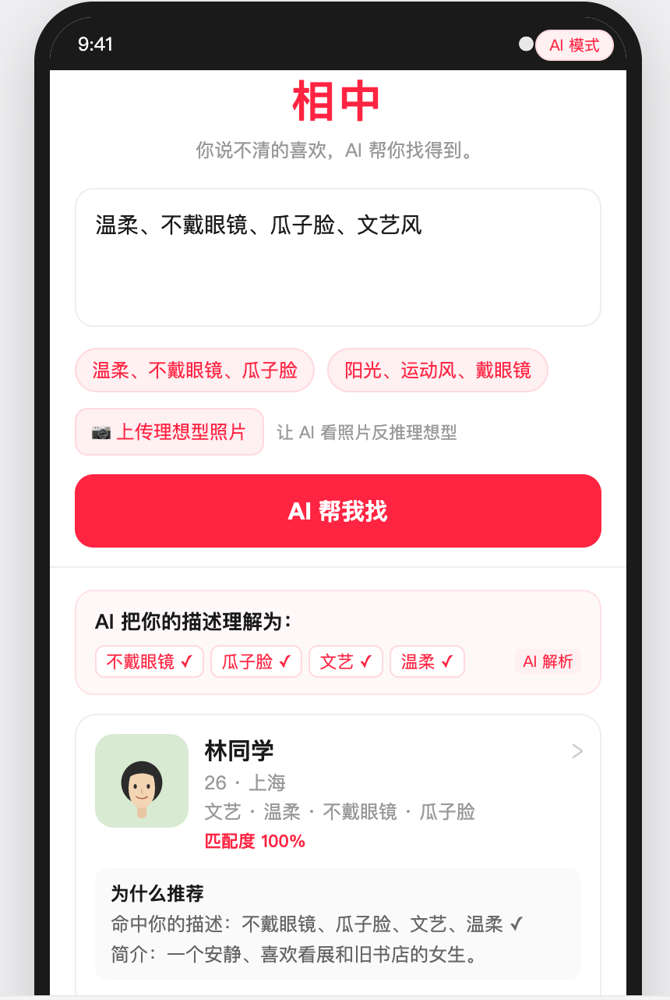
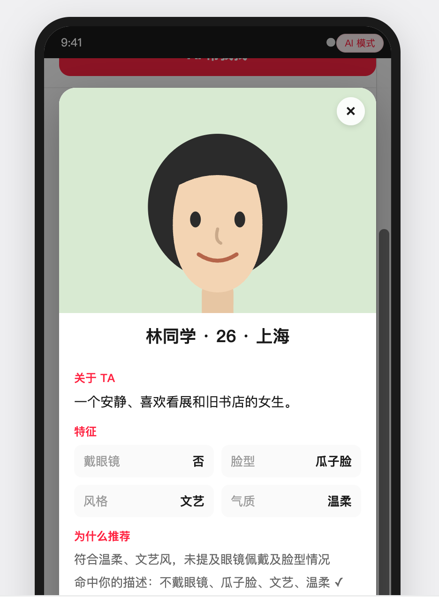

ai coding思考过程
以下文字纯手工记录，非大模型生成，以体现思考过程。

下面是回顾题目本身：
我是一个项目的重要参与者：小红书社交突破，需要在小红书软件之外新起平台软件做相亲市场业务

目标：长尾需求被满足
此前市面常见的相亲软件的做法：
    1完全看照片，用户滑动筛选
    2录入比较详细的个人消息 通过条件配对
我们想要做的突破：
     3隐含意图的筛选：
        比如说，我想要在相亲软件里寻找符合我心意的另一半：不戴眼镜，瓜子脸（这类消息在相亲软件里一般没有直接预设，
        不能直接使用数据筛选筛选），然后我们现在可以利用Ai的能力，去帮助用户做这一步筛选；

可以明显体会到是一种ai应用在业务上的拓展场景。
我的初期动作与思考：
    首先让ai对我们的需求进行辅助分析，初步定下首先创建demo进行展示的思路。
    但是由于选择使用模型的生成速度的原因，在有限时间内无法得到一个可以展示的产物，后续采用ppt+demo同步进行的方案。
    然后按照我aicoding的习惯，分步对demo进行开发，具体表现为：
        1.使用claude.md这类对模型的提示约束，让他按照良好的开发风格进行开发（模块化，高内聚低耦合之类）
        2.按照文档有限，以文档驱动开发，也就是所谓spec coding
    初期开发的流程为->非真实ai调用的全链路->真实多模态大模型ai接入。
    得到了初步的开发界面（如图一）：

    图一

    此时对demo进行全方位体验后，发现明显有几个问题：
        1.生成推送的延迟，这在c端是最不可容忍的
        2.信息展示的程度，对于我们在卡片页面展示的信息（如图二），一些大模型解析得到的隐含信息不应该显式地展示出来
        ，候选人卡片界面应该简单明了地展示照片以及年龄地址这些基本信息。

    图二
        3.对于用户注册发布个人消息与用户获取信息的生成方案需要进行隔离

    对于相应问题具体的思考为：
        1.计算每个候选人并进行照片分析，应该是线下异步做的，也就是我们传统c端的思想，一个用户在上传  
        他的照片和信息的时候，对于这个用户的终端，我们需要进行实时反馈，立即返回创建成功。但是我们后台对照片以及其他信息的  
        分析，都要异步做（事务加消息队列，然后解析用户信息，再建类似es的索引），其他用户在查询时，只需要把他们的需求和我  
        们库里已经解析好的信息做对比就行，可以用大模型，也可以用简单的硬匹配，保证延时，同事也要做冷加载以及一些兜底处理  
        ，当没匹配到，或者大模型失效时，用传统相亲软件预填的一些信息进行匹配，然后推送feed流。整体的处理其实和在小红书发帖，
        然后其他人更新feed流类似，看似加了一层ai应用，其实本质的稳定性，延时这些，都需要我们系统的方案进行保证和兜底。
        这里描述比较多一点，同时我们也要考虑用户注册到es这类库里的延迟问题，因为我们无法保证每次新用户注册，我们都完全零
        延时更新索引，消费应该也是异步的，就会有数据库落后的情况发生，我觉得在c端场景下，强一致性的优先级要低于用户体验与返回延时的，
        所以用稍微落后一些的数据库进行查询应该是比较符合落地的方案。

        2.大模型调用本身也需要做降级以及重试策略，当一个api宕机，需要有其他的都低策略。然后在成本上我们也需要做取舍，
        比如说，用户的需求是戴不戴眼镜这类描述，其实我们在异步的后端已经提前用大模型做了解析并填上了隐含信息，就不用再调用大模型，
        直接用规则匹配就好。当整个服务链都不能work的时候，我们肯定还要做推送的生成（用热门列表就行，具体的话降级链大概是：
        解析查询失败->退化为文本描述解析->退化为候选自填结构化字段（注册时填的）匹配->退化为热门列表feed），
        避免白屏和404这种对c端0容忍的情况。

        3.整个项目中缓存的使用应该也是至关重要的，一些常见高频的需求比如：眼镜，温柔，我们肯定可以预热到缓存中，
        避免大模型的冗余调用。从缓存中拿到大的表后，再去用每个用户的地区、年龄之类+随机进行个性化推荐。

        4.是用户描述之外的隐含信息的回去，就需要拿和存用户的行为信息，比如在某个候选人卡片的停留时间之类，
        但是这部分功能在实现的时候我们还需要考虑的是隐私权限的问题，需要给用户一个开关，
        让他选择软件能否用他的行为信息为他推送潜在的心动人选。

        5.最后的最后，站在产品的角度上思考，还有两点，（1）当用户的需求被清晰描述，且我们使用行为信息做隐含意图时，
        也需要偶尔推送一些超出常规筛选列表的心动候选人，避免陷入茧房与导致用户刷腻审美疲劳的情况。（2）因为我们使用ai进行辅助推荐，
        以及隐含意图的辅助查询，肯定会有ai生成可靠性的问题，可以随机在卡片周围弹出选项，让用户选择是不是满足他的需求，
        以及与他需求的差距在哪里。我们拿到这些feedback，就可以对效果进行优化。